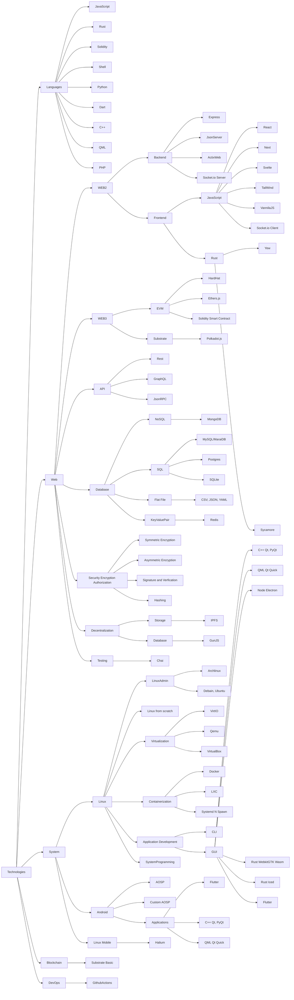

# My Tech Knowlege

```mermaid
graph LR
    T[Technologies] --> L[Languages]
        L --> JavaScript
        L --> Rust
        L --> Solidity
        L --> Shell
        L --> Python
        L --> Dart
        L --> C++
        L --> QML
        L --> PHP

    T --> W[Web]
        W --> W2[WEB2]
            W2 --> B[Backend]
                B --> Express
                B --> JsonServer
                B --> ActixWeb
                B --> SIOS[Socket.io Server]

            W2 --> F[Frontend]
                F --> JS[JavaScript]
                    JS --> React
                    JS --> Next
                    JS --> Svelte
                    JS --> TailWind
                    JS --> VannilaJS
                    JS --> SIOC[Socket.io Client]
                F --> RS[Rust]
                    RS --> Yew
                    RS --> Sycamore

        W --> W3[WEB3]
            W3 --> EVM
              EVM --> HardHat
              EVM --> Ethers.js
              EVM --> SC[Solidity Smart Contract]
            W3 --> Substrate --> Polkadot.js

        W --> A[API]
            A --> Rest
            A --> GraphQL
            A --> JsonRPC

        W --> D[Database]
            D --> NoSQL --> MongoDB
            D --> SQL --> MySQL/MaraiDB
              SQL --> Postgres
              SQL --> SQLite
            D --> FF[Flat File] --> Any[CSV, JSON, YAML]
            D --> KeyValuePair --> Redis

        W --> SEA[Security Encryption Authorization]
            SEA --> SE[Symmetric Encryption]
            SEA --> AE[Asymmetric Encryption]
            SEA --> SV[Signature and Verfication]
            SEA --> Hashing

        W --> DE[Decentralization]
            DE --> Storage --> IPFS
            DE --> Database --> GunJS

        W --> Testing --> Chai

    T --> S[System]
        S --> LX[Linux]
          LX --> LA[LinuxAdmin]
              LA --> Archlinux
              LA --> Deb[Debain, Ubuntu]
          LX --> LFS[Linux from scratch]
          LX --> Vt[Virtualization]
              Vt --> VirtIO
              Vt --> Qemu
              Vt --> VirtualBox
          LX --> Ctnr[Containerization]
              Ctnr --> Docker
              Ctnr --> LXC
              Ctnr --> SDN[Systemd N Spawn]
          LX --> Apps[Application Development]
              Apps --> CLI
              Apps --> GUI
                GUI --> QT[C++ Qt, PyQt]
                GUI --> QQ[QML Qt Quick]
                GUI --> El[Node Electron]
                GUI --> WG[Rust WebkitGTK Wasm]
                GUI --> RI[Rust Iced]
                GUI --> Flutter
          LX --> SystemProgramming
        S --> AN[Android]
          AN --> AOSP
          AN --> ABS[Custom AOSP]
          AN --> APPS[Applications]
                APPS --> AFl[Flutter]
                APPS --> AQT[C++ Qt, PyQt]
                APPS --> AQQ[QML Qt Quick]
        S --> LM[Linux Mobile]
          LM --> Halium

    T --> BC[Blockchain]
        BC --> Sub[Substrate Basic]

    T --> DevOps --> GithubActions

```
